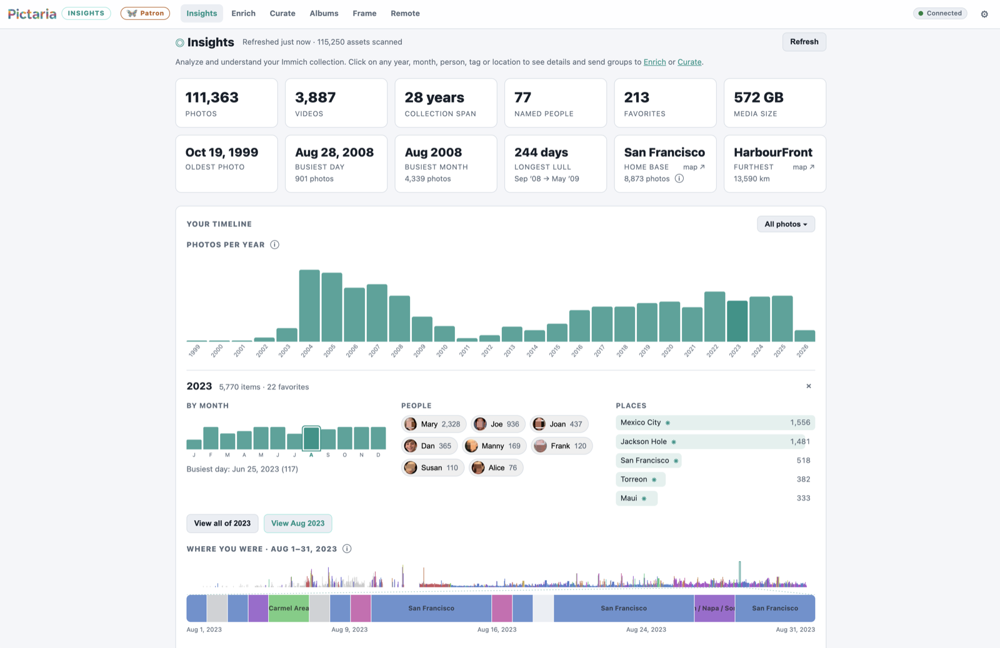
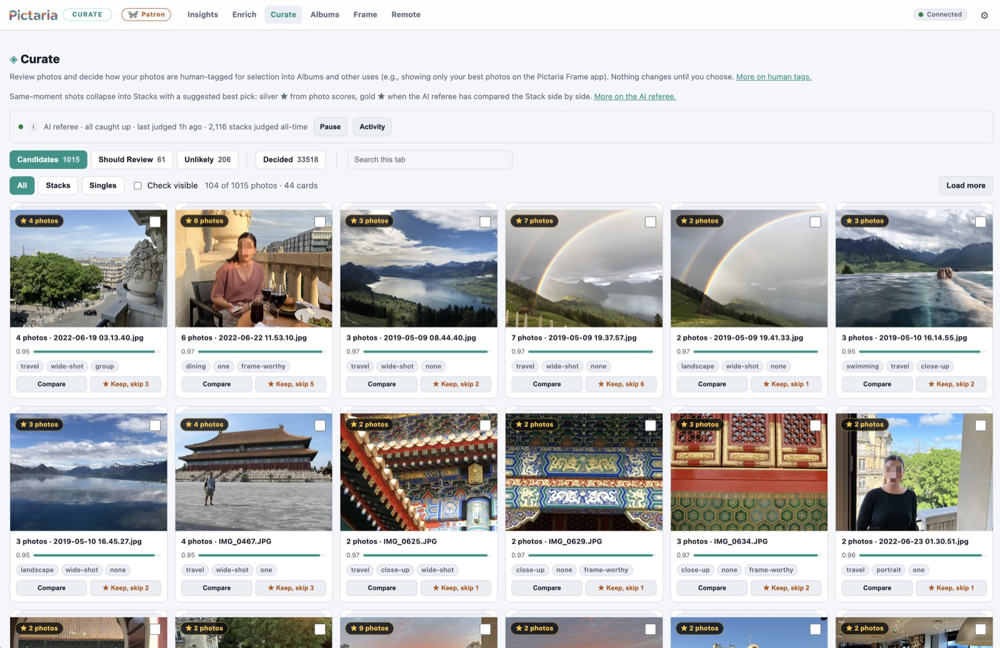
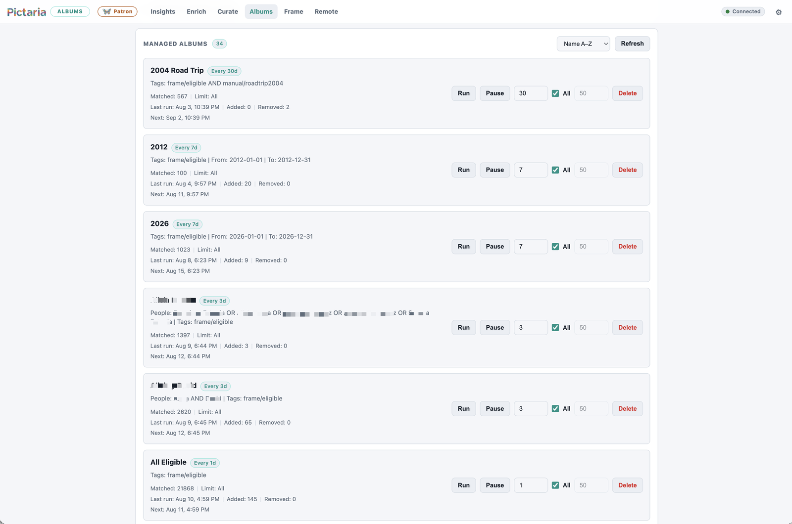
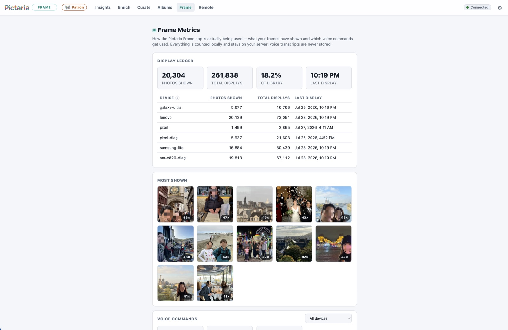

# Pictaria Server

Self-hosted companion server for [Pictaria Frame](https://pictaria.ai/frame), the photo-frame app. One container, one Node process, zero npm dependencies, works with your [Immich](https://immich.app) library.

Pictaria Server bundles everything the frame needs on the server side — and a dashboard that helps you understand your whole library:

- **Insights** — understand your collection (`/insights.html`): photos per year with a person/place/tag lens, a "where you were" timeline with auto-detected trips, a people constellation (faces linked by shared photos), records (busiest day, home base, furthest from home), and leaderboards for people, places, cameras, and tags. Every number is clickable — browse the photos behind it, open the same view in Immich, or turn it into an album. Everything is computed by Pictaria from a periodic Immich sweep; optional Geoapify place naming sends coordinates to the provider you configured.
- **Enrich** — AI photo classification into a controlled taxonomy (`/enrich.html`). Works with operator-hosted Ollama, LM Studio, llama.cpp and other OpenAI-compatible endpoints, or through the cloud with OpenAI, OpenRouter, Venice, or Ollama's cloud models.
- **Curate** — the human review workflow that decides what your frame shows (`/curate.html`). Same-moment photos collapse into **Stacks** with a suggested keeper: a silver ★ from frame-worthiness scores, or a gold ★ when the optional AI referee has compared the group side by side.
- **Smart Albums** — saved Immich searches (people, tags, places, dates, cameras, or free-text ranked search) that keep real Immich albums up to date on a schedule (`/albums.html`). A free-text rule can run in **Best of** mode: each search hit is double-checked against your own enrichment data and the keepers are ranked by your Curate decisions and photo scores — a "Top 50" that is your best 50, not Immich's first 50. Each run re-syncs the album to its rule, and deleting a rule never deletes the Immich album itself. ([Rules, Best of, the sync.](docs/ALBUMS.md))
- **Frame Remote** — see what each frame is showing and control it live from your phone (`/remote.html`). Multiple frames run off one server: each device reports under its own name, and a device picker appears when more than one is known so commands reach only the frame you chose. Retired or re-onboarded devices are cleaned up under Settings → Devices.
- **Voice** — intent parsing, photo Q&A ("where was this taken?"), "what's interesting about this photo", one-shot general Q&A ("tell me …"), photo show-search, and TTS for Pictaria Frame. Try-it testers live in Settings → Voice TTS.
- **Frame Metrics** — what your frames have actually shown and which voice commands get used (`/metrics.html`, the "Frame" nav item). Counts only; voice transcripts are never stored.
- **Settings** — nearly all configuration is editable at runtime from the web UI (`/settings.html`); changes apply immediately, no restart.
- **Activity** — a local chronological history of Enrich, Curate, Frame, voice, settings, and server events (`/activity.html`), with filters and bounded JSON/CSV downloads. Sensitive content such as prompts, transcripts, captions, job logs, and provider errors is never projected into the feed.
- **Ambient** — weather and location display strings for the frame's ambient screen.

## See Pictaria Server

These are the same privacy-scrubbed product views published on the
[Pictaria Server page](https://pictaria.ai/server). Select any image to open it
at full size.

<table>
  <tr>
    <td width="50%">
      <a href="docs/images/server-insights-timeline.png"></a><br>
      <strong>Insights</strong> — collection statistics, people and places, and the timeline behind them.
    </td>
    <td width="50%">
      <a href="docs/images/server-curate.jpg"></a><br>
      <strong>Curate</strong> — related shots become stacks with a suggested keeper and a human decision.
    </td>
  </tr>
  <tr>
    <td width="50%">
      <a href="docs/images/server-albums.png"></a><br>
      <strong>Smart Albums</strong> — saved rules keep real Immich albums synchronized on a schedule.
    </td>
    <td width="50%">
      <a href="docs/images/server-frame-hub.jpg"></a><br>
      <strong>Frame Metrics</strong> — a local display ledger shows what each Pictaria Frame has presented.
    </td>
  </tr>
</table>

## Quick start (Docker)

Production installs should select an explicit reviewed release. The source
tag and matching versioned GHCR image keep the deployment inputs aligned.

```sh
PICTARIA_RELEASE=v1.0.1 # replace with the release you are installing
mkdir pictaria-server && cd pictaria-server
curl -fsSLO \
  "https://raw.githubusercontent.com/pictaria-ai/pictaria-server/${PICTARIA_RELEASE}/docker-compose.yml"
curl -fsSL -o .env \
  "https://raw.githubusercontent.com/pictaria-ai/pictaria-server/${PICTARIA_RELEASE}/.env.example"
chmod 600 .env
# edit .env: set IMMICH_BASE_URL, IMMICH_API_KEY, and a non-empty APP_PASSWORD
# for off-machine Docker backups, also follow docs/BACKUP.md to mount the
# destination and set BACKUP_DIR to its container path
docker compose config --images # must name the selected numeric release, not latest
docker compose pull
docker compose up -d
```

Open `http://your-host:4080`, enter your app password, and you're in.

Pictaria Server v1 requires **Immich 2.0 or newer**. It has been tested with
Immich 2.7.5 and 3.1.0; other versions may work but are not explicitly
validated. See [Immich compatibility](docs/IMMICH-COMPATIBILITY.md) before
upgrading Immich.

## Quick start (bare Node)

Requires Node 22.16+ on the 22 line, or 23.8+ beyond it (`node:sqlite`
and its online-backup API; earlier builds fail at boot — `engines` says
`^22.16.0 || >=23.8.0`). The production container and CI suite use Node 22;
newer supported versions work as well.

```sh
PICTARIA_RELEASE=v1.0.1 # replace with the release you are installing
git clone --branch "$PICTARIA_RELEASE" --depth 1 \
  https://github.com/pictaria-ai/pictaria-server.git
cd pictaria-server
cp .env.example .env   # edit as above
chmod 600 .env
npm start
```

### Development preview

To evaluate unreleased work, clone the moving `main` branch and build it
locally. This path can change between releases and is not the production
install or upgrade procedure:

```sh
git clone https://github.com/pictaria-ai/pictaria-server.git
cd pictaria-server
cp .env.example .env   # edit as above
chmod 600 .env
docker compose up -d --build
```

For every later production update, follow [Upgrading](docs/UPGRADING.md) and
select the release you intend to run.

Either way, continue with the **[first-run checklist](docs/GETTING-STARTED.md)** — connect Immich, install the app, and switch on the optional features one by one.

## Configuration

Only a handful of values have to be environment variables: the listen address/port, the data paths, and `APP_PASSWORD`. Everything else — the Immich connection, AI providers and models, voice, weather, backups — can be set (and changed at any time, no restart) from the web UI. Provider connections and model identifiers live under **Settings → AI Providers**; choose the provider used for new enrichment runs on **Enrich**, where the selection is remembered across visits and restarts. Every UI-editable field also has an env-var form for infrastructure-as-code setups; a value saved in the UI overrides the environment until cleared.

See [docs/CONFIGURATION.md](docs/CONFIGURATION.md) for the complete reference and [.env.example](.env.example) for an annotated starter file. The short version:

| Variable | Required | What it does |
| --- | --- | --- |
| `IMMICH_BASE_URL` | yes (env or Settings) | Server-reachable Immich address over HTTP or HTTPS, e.g. `http://immich.local:2283` or `https://photos.example.com`; omit trailing `/api` |
| `IMMICH_API_KEY` | yes (env or Settings) | An Immich API key for your account — full access not required; see the least-privilege checklist in [Getting started](docs/GETTING-STARTED.md) |
| `APP_PASSWORD` | strongly recommended | Protects the API and web UI (env-only). Blank or missing refuses startup unless `ALLOW_INSECURE_OPEN=true`. |
| `ALLOW_INSECURE_OPEN` | no | Dangerous explicit opt-in to run without authentication. Anyone who can reach the server can browse photos and perform Immich-backed mutations. |
| `OPENAI_API_KEY` / `OPENAI_COMPATIBLE_*` / `LMSTUDIO_*` / `OPENROUTER_*` / `OLLAMA_*` / `VENICE_*` | for Enrich | Provider connections and vision-model identifiers; configure the same values under Settings → AI Providers |
| `DEFAULT_PROVIDER` | no | Initial/infrastructure fallback for Enrich; choosing a provider on the Enrich page saves the active choice for future runs |
| `INFERENCE_HOST_LABEL` | no | Optional operator-authored label saved with new Enrich run summaries for comparing inference machines; editable under Settings → Enrich |
| `TTS_PROVIDER` + keys | for Voice | `openai` or `elevenlabs` text-to-speech |
| `WEATHER_DEFAULT_LOCATION` | for Ambient | Default weather place (any city name or US zip) |
| `GEOCODING_PROVIDER` + `GEOAPIFY_API_KEY` | optional | Reverse geocoding for nicer location labels |

Both HTTP and HTTPS Immich connections are supported. Publicly trusted HTTPS
certificates work normally; a private/home CA must be trusted by the Node
process inside the container. Addresses without a scheme default to HTTP, so
enter the full `https://` address when you intend to use TLS. See
[Configuration](docs/CONFIGURATION.md#immich-http-https-and-private-cas) for a
private-CA example and the distinction between the server-reachable
`IMMICH_BASE_URL` and browser-facing `IMMICH_PUBLIC_URL`.

All state lives in one directory (`./data`, or the `/data` volume in Docker): `enrichment.sqlite`, `smart-albums.json`, `frame.db`, `settings.json`, `insights.sqlite`, custom models under `wake-word-models/`, and automatic snapshots under `backups/`.

## Privacy

Pictaria Server has no telemetry, analytics, or Pictaria-operated cloud service.
It does make the connections needed for features you choose:

- Your Immich server supplies library data and images and receives the album,
  tag, description, or location writes you explicitly enable.
- Enrich sends the selected image rendition to its selected model. The spoken
  **Interesting** command independently sends an Immich preview plus the
  photo's date, location, and filename to the voice-answer model you selected.
  A local model keeps those requests within infrastructure you operate; a
  cloud model receives them through your own provider account.
- Weather sends the requested city or US ZIP to Open-Meteo for geocoding and
  the resulting coordinates for the forecast. Optional Geoapify place naming
  sends photo or calculated home coordinates to your configured account.
- A selected TTS provider receives the answer text it turns into speech.

Insights statistics and app metrics are stored locally. Voice usage counters
record only a command label and timestamp; transcripts are never stored.

## Exposing beyond your LAN

Pictaria Server is built as a LAN tool: it speaks plain HTTP and uses a single shared password. If you want to reach it from outside your network, don't port-forward it directly — put it behind an HTTPS reverse proxy (Caddy, nginx, Traefik) or a VPN/tunnel like Tailscale or WireGuard, and keep the server itself listening only where the proxy can reach it.

If Docker publishes the port directly on a Tailscale or other VPN-owned host
address, read the [VPN boot-order guidance](docs/RUNNING.md#docker-with-a-vpn-owned-host-address).
The default `4080:4080` mapping does not have that address dependency.

When it is only ever reached through HTTPS, also set `SESSION_COOKIE_SECURE=true` so the browser session cookie is never sent over plain HTTP (leave it unset for normal LAN use — it breaks plain-`http://` login). For a public custom domain, set `BROWSER_ALLOWED_HOSTS` to its exact `host` or `host:port` (comma-separated for more than one). IP addresses, single-label LAN names, `.local`, `.home.arpa`, and Tailscale `.ts.net` names are accepted automatically. This allowlist keeps an arbitrary DNS-rebinding hostname from serving the login UI, becoming its own cookie/Origin trust anchor, or reaching the API in deliberate open mode.

Configure the proxy to preserve the browser-facing `Host` header: Pictaria compares that host and port with the browser's `Origin` and rejects foreign browser Fetch Metadata to prevent cross-origin API requests, including in deliberate open mode. Native and programmatic clients that send no browser headers remain supported. TLS may terminate at the proxy; the schemes do not need to match. nginx does **not** preserve the public host by default, so its Pictaria location needs this explicit directive:

```nginx
proxy_set_header Host $http_host;
proxy_set_header X-Forwarded-For $proxy_add_x_forwarded_for;
```

Whatever proxy you use, confirm that the upstream `Host` remains the public host and port the browser requested and that the same authority is in `BROWSER_ALLOWED_HOSTS`. To keep one device's failed logins from locking out every user behind the proxy, set `TRUSTED_PROXY_IPS` to the proxy's exact address or narrow network (comma-separated IPs/CIDRs). Pictaria ignores `X-Forwarded-For` unless the direct peer is trusted, and evaluates trusted chains from right to left; never configure a catch-all such as `0.0.0.0/0`. Leave this unset for direct LAN/VPN access. The auth model stays a single shared password with bounded concurrent password work, a ~1s failure delay, per-client lockout, and a higher global failure ceiling; there are no per-user accounts or roles, so treat access as all-or-nothing when deciding who gets the URL.

## API

Everything is under `/api/` and requires auth when `APP_PASSWORD` is set: programmatic callers send the password as an `X-App-Password` header or `Authorization: Bearer`; the web UI logs in once (`POST /api/session`) and rides an HttpOnly session cookie for 30 days — the browser never stores the password itself. Login bodies are limited to 4 KiB and must arrive within 5 seconds. Cookie-authenticated and deliberate-open browser API requests reject foreign/null origins and cross-/same-site Fetch Metadata; native clients without browser headers remain supported. JSON endpoints also require an `application/json` content type. Session signatures combine the current password with a random per-installation secret stored in the data directory, so they survive ordinary restarts, immediately expire when the password changes, and cannot be used to test password guesses by themselves. Upgrading an older install to this session format asks each browser to log in once. `/api/health` always answers, but tells unauthenticated callers only `{ ok, service, time, authRequired }` — configuration details need credentials. Feature prefixes: `/api/review`, `/api/enrich`, `/api/taxonomy`, `/api/albums`, `/api/frame` (including wake-word models), `/api/voice`, `/api/photos`, `/api/assets`, `/api/weather`, `/api/insights`, `/api/activity`, `/api/settings`, `/api/support`, `/api/backup`.

Text-to-speech uses authenticated `POST /api/voice/tts` with
`Content-Type: application/json` and a body shaped as `{ "text": "What to
say" }`. A successful response is the provider's audio payload; the
`X-TTS-Provider` and optional `X-TTS-Voice` response headers describe it.
`GET /api/voice/tts` is not supported and never dispatches provider work.

## Documentation

- [docs/GETTING-STARTED.md](docs/GETTING-STARTED.md) — the first-run checklist, from login to a configured frame.
- [docs/IMMICH-COMPATIBILITY.md](docs/IMMICH-COMPATIBILITY.md) — supported and tested Immich versions, runtime checks, and the upgrade checklist.
- [docs/WAKE-WORDS.md](docs/WAKE-WORDS.md) — custom wake-phrase creation, licensing, testing, deployment, and troubleshooting.
- [docs/VISION.md](docs/VISION.md) — the Pictaria way: understand, find the best, select, enjoy.
- [docs/CONFIGURATION.md](docs/CONFIGURATION.md) — every environment variable, with defaults.
- [docs/ARCHITECTURE.md](docs/ARCHITECTURE.md) — module layout and conventions.
- [docs/INSIGHTS.md](docs/INSIGHTS.md) — how Insights works (sweep, snapshot, timeline, trips).
- [docs/ALBUMS.md](docs/ALBUMS.md) — how Smart Albums works (rules, Best of, the sync, exclusions, lifecycle).
- [docs/ENRICH.md](docs/ENRICH.md) — how Enrich works (pipeline, providers, taxonomy, prompts, queue, review model).
- [docs/RECOMMENDED-MODELS.md](docs/RECOMMENDED-MODELS.md) — dated, role-by-role local and cloud model starting points.
- [docs/ACTIVITY.md](docs/ACTIVITY.md) — what the local activity history records, excludes, and retains.
- [docs/BACKUP.md](docs/BACKUP.md) — what to back up, the built-in automatic backups, and restore.
- [docs/RUNNING.md](docs/RUNNING.md) — running as a service (launchd, systemd) and uptime monitoring.
- [docs/UPGRADING.md](docs/UPGRADING.md) — moving an existing install to a newer release, and rolling back.
- [SECURITY.md](SECURITY.md) — supported versions, security boundaries, and private vulnerability reporting.
- [SUPPORT.md](SUPPORT.md) — where to ask for help and what diagnostic context is safe to share.
- [CHANGELOG.md](CHANGELOG.md) — release history.

## Development

```sh
npm test   # node --test; no dependencies to install
```

The suite includes browser-level smoke tests (`test/browser/`) that drive the real admin pages — login gate, Insights lens search, Curate, Smart Album create/validate — in headless Chrome over raw CDP, still with zero npm dependencies. They use a system Chrome/Chromium if one is installed (set `PICTARIA_CHROME_BIN` for a non-standard path) and skip cleanly when none is found.


## Design rules

- Zero npm dependencies; Node built-ins only.
- The taxonomy file is configuration, not code: tags, thresholds, and review-bucket policy live in `taxonomy/v1.json` so users can tune behavior without touching source.
- Human decisions always win over AI output.
- SQLite is the local source of truth; Immich is synced to, never trusted as the record of review decisions.
- One password, one data directory, one process: setup should never be the hard part.

## License

Pictaria Server is free software, licensed under the
[GNU Affero General Public License, version 3 only](LICENSE)
(`AGPL-3.0-only`). You may run the unmodified server freely, and private
modifications used only by you do not need to be published. Commercial use,
including paid hosting, is permitted. If you distribute a modified copy or
let others interact with a modified version over a network, you must offer
those users the corresponding source under the same license.

Contributions are welcome under the same license with a lightweight
[Developer Certificate of Origin sign-off](CONTRIBUTING.md) — no CLA.

Copyright © 2026 Pictaria and contributors.

The files under `public/brand/` are included under the AGPL for copyright
purposes. The license does not grant trademark rights in the Pictaria name or
logos, or permission to present a derived product as official or endorsed by
Pictaria.
